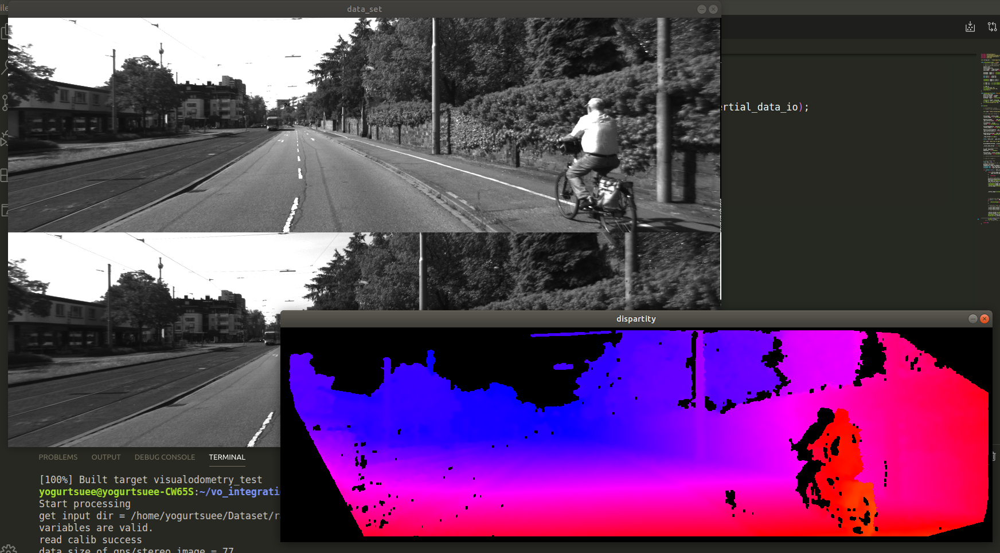

# stereomappter后台测试程序

[stereomapper](https://github.com/willSapgreen/stereo-vision)的qt程序似乎有一些问题，先在后台测试一下各个模块的运行情况。
熟悉一下整个程序。各个模块的信息整理在[这里](http://mecha-su.cn/2020/02/24/vision-slam-2/)。

原来的代码依赖很少，现在想要给它退化一下。

## readfromfiles线程

[readfile_test](app/readfile_test.cpp)

读取校正信息和图片并输出。

## VisualOdometryStereo线程

[readfile_test](app/visualodometry_test.cpp)
已然破坏了整个程序。

## stereothread线程

able to get disparity serially.

[stereo_test](app/stereo_test.cpp)

## libviso2（稀疏特征）

用来估计姿态。

与外部程序（stereothread线程）的接口`_visual_odom_thread->run()`
`_visual_odom_thread`有一个`_visualOdomStereo`，
在`run`中调用`_visualOdomStereo->process(_simg->I1, _simg->I2, dim, false)`，

即里程计类`VisualOdometryStereo`的实例为`_visualOdomStereo`,是`libviso2`的接口。

`process`是里程计类的主要方法，来自`libviso2`的`viso_stereo.cpp/.h`。

输出如下：

* `Matrix H_Delta = _visualOdomStereo->getDeltaMotion()`
* `_visualOdomStereo->calculateRollPitchYawFromTransformation( _delta_roll, _delta_pitch, _delta_yaw );`
* `_visualOdomStereo->calculateVelocityFromTransformation( _delta_vel );`
* `vector<int32_t> inliers = _visualOdomStereo->getInlierIndices()`
* `_gain = _visualOdomStereo->getGain( inliers )`

核心操作是处理`Matcher`类`_matcher`，得到结果后将匹配点传递给`_p_matched`，后续在`updateMotion()`中处理。
`updateMotion()`来自父类的`protected`方法，核心操作是`estimateMotion`（非继承）和`transformationVectorToMatrix`（继承自`VisualOdometry`）

## elas（稠密特征）

用来稠密重建，接口为`_stereo_thread->run()`中的`elas.process(...);`输出为深度图。

## 重建任务

`StereoThread::addDisparityMapToReconstruction`中实现。